These first chunks of code load the libraries and data we'll use throughout. It's common practice to place your libraries and data right up front. 


```r
#install.packages("tidyverse") # run this line once in console to get package
library(tidyverse)

#install.packages("leaflet") # run this line once in console to get package
library(leaflet)
```


```r
# We'll use this R-Chunk to import all our datasets.

#We'll first grab covid data from the NY Times GitHub repo. 
covid_data <- read_csv("https://raw.githubusercontent.com/nytimes/covid-19-data/master/us.csv")
covid_state_data <- read_csv("https://raw.githubusercontent.com/nytimes/covid-19-data/master/us-states.csv")

#Now let's grab data from the Census for state populations. 
census_data <- read_csv("https://www2.census.gov/programs-surveys/popest/datasets/2020-2021/state/totals/NST-EST2021-alldata.csv")
```

## Background
This is the first RMarkdown file we'll use in class.  Once you open the file, you may see messages that you are missing some packages needed. Feel free to click the messages that ask you to install the packages, or install them manually by running the following lines. Note that there is an "eval = FALSE" command in the top of the block of code below, which prevents this code chunk from running when you knit the document.


```r
install.packages("tidyverse")
install.packages("leaflet")
```

Once you have all the packages installed, click on Knit to create your document. You may need to install some other packages as well, the first time you click Knit. An HTML document should appear. 

This goal for this document is to provide you an example of an RMarkdown (.Rmd) file to use as an example for the rest of the semester. We'll use the `tidyverse` packages to wrangle some data related to the COVID pandemic and produce a few visualizations. Then we'll see a few more visualizations using the `ggplot()` command (gg stands for Grammar of Graphics), something we'll be exploring extensively in the next few weeks. We'll finish with a brief demonstration of the leaflet package.

Note that you do not need to be able to reproduce anything from this document, rather the main goal is to (1) make sure you know how to install packages, (2) knit RMarkdown documents in RStudio, and (3) make minor edits to .Rmd documents.  

## Data Wrangling

It's common practice to load your data at the top of a report, and then before creating any graphics, wrangle the data.  We loaded 2 data sets from the NY Times COVID github repo. The data sets contain total case counts. The next block of code uses `mutate` to add another column to these data sets that gives the daily case counts.


```r
# We now clean & wrangle our data.
census_data <- 
  census_data %>% 
  select(NAME, POPESTIMATE2021) %>% 
  rename(pop = POPESTIMATE2021) %>% 
  rename (state = NAME)

covid_data <- 
  covid_data %>% 
  mutate(daily_new_cases = cases - lag(cases)) 

covid_state_data <- 
  covid_state_data %>% 
  group_by(state) %>% 
  mutate(daily_new_cases = cases - lag(cases)) %>% 
  left_join(census_data)
```

We can view these data sets in many ways. 


```r
# Both of the following call the head() function. 
# The second uses pipe (%>%) notation, which allows us to focus on the data first, and then the action second. 
# Rather than f(x), so f at x, piping notation let's us write x %>% f, or x goes into f. 
head(covid_data)
```

```
## # A tibble: 6 x 4
##   date       cases deaths daily_new_cases
##   <date>     <dbl>  <dbl>           <dbl>
## 1 2020-01-21     1      0              NA
## 2 2020-01-22     1      0               0
## 3 2020-01-23     1      0               0
## 4 2020-01-24     2      0               1
## 5 2020-01-25     3      0               1
## 6 2020-01-26     5      0               2
```

```r
covid_data %>% head()
```

```
## # A tibble: 6 x 4
##   date       cases deaths daily_new_cases
##   <date>     <dbl>  <dbl>           <dbl>
## 1 2020-01-21     1      0              NA
## 2 2020-01-22     1      0               0
## 3 2020-01-23     1      0               0
## 4 2020-01-24     2      0               1
## 5 2020-01-25     3      0               1
## 6 2020-01-26     5      0               2
```

```r
#glimpse lists the variables on the left, rather than the top. 
covid_data %>% glimpse()
```

```
## Rows: 820
## Columns: 4
## $ date            <date> 2020-01-21, 2020-01-22, 2020-01-23, 2020-01-24, 2020-~
## $ cases           <dbl> 1, 1, 1, 2, 3, 5, 5, 5, 5, 6, 7, 8, 11, 11, 11, 12, 12~
## $ deaths          <dbl> 0, 0, 0, 0, 0, 0, 0, 0, 0, 0, 0, 0, 0, 0, 0, 0, 0, 0, ~
## $ daily_new_cases <dbl> NA, 0, 0, 1, 1, 2, 0, 0, 0, 1, 1, 1, 3, 0, 0, 1, 0, 0,~
```

```r
covid_state_data %>% glimpse()
```

```
## Rows: 43,014
## Columns: 7
## Groups: state [56]
## $ date            <date> 2020-01-21, 2020-01-22, 2020-01-23, 2020-01-24, 2020-~
## $ state           <chr> "Washington", "Washington", "Washington", "Illinois", ~
## $ fips            <chr> "53", "53", "53", "17", "53", "06", "17", "53", "04", ~
## $ cases           <dbl> 1, 1, 1, 1, 1, 1, 1, 1, 1, 2, 1, 1, 1, 2, 1, 1, 1, 2, ~
## $ deaths          <dbl> 0, 0, 0, 0, 0, 0, 0, 0, 0, 0, 0, 0, 0, 0, 0, 0, 0, 0, ~
## $ daily_new_cases <dbl> NA, 0, 0, NA, 0, NA, 0, 0, NA, 1, 0, 0, 0, 0, 0, 0, 0,~
## $ pop             <dbl> 7738692, 7738692, 7738692, 12671469, 7738692, 39237836~
```

If you want to view the data as a spreadsheet, then the `View()` command will do this for you, but beware that using `View()` in an RMarkdown file may cause problems when trying to knit (hence the "eval = FALSE" at the top of the code chunk below).


```r
covid_data %>% View()
covid_state_data %>% View()
```

## Data Visualization
Now let's examine a few visualizations, using `ggplot()`, part of the `tidyverse`. First let's look at cases in the US, as totals, and then as daily new cases. 


```r
# Use this R-Chunk to plot & visualize your data!
covid_data %>% 
  ggplot(aes(x = date, y = cases)) +
  geom_line() +
  labs(title = "Total Cases in the US over time")
```

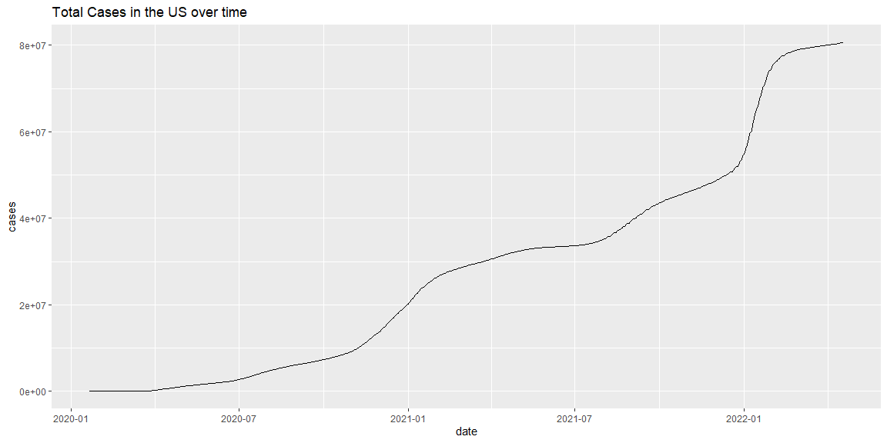<!-- -->


```r
covid_data %>% 
  mutate(daily_new_cases = cases - lag(cases)) %>% 
  ggplot() +
  geom_line(aes(x = date, y = daily_new_cases)) +
  labs(title = "Daily New Cases in the US")
```

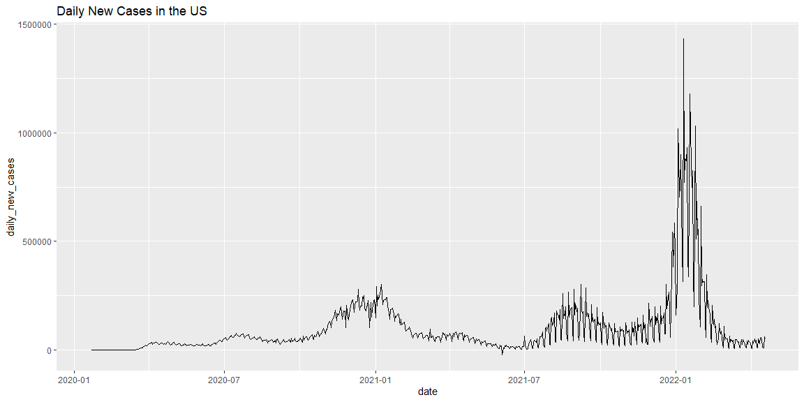<!-- -->

Now let's compare some states in various ways, using a few different features from `ggplot()`. 


```r
covid_state_data %>% 
  filter(state %in% c("Idaho","Utah")) %>% 
  ggplot(aes(x = date, y = cases)) +
  geom_line() +
  facet_wrap(~state,ncol = 1) +
  labs(title = "Total Cases in Two States over time")
```

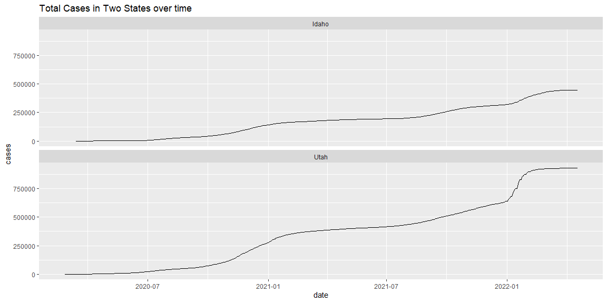<!-- -->


```r
covid_state_data %>% 
  filter(state %in% c("Idaho","Utah")) %>% 
  ggplot(aes(x = date, y = cases, color = state)) +
  geom_line() +
  labs(title = "Total Cases in Two States over time")
```

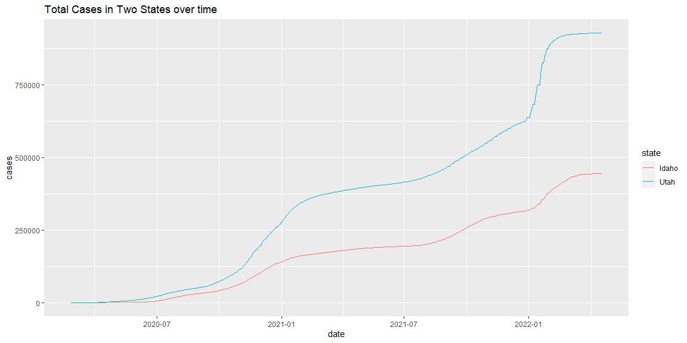<!-- -->

Do you prefer the facet wrap option, or putting the two plots on the same graph?  Either way, without taking population into account (there are more people in Utah than Idaho), the comparison is lacking.  We loaded the census data precisely so we can make a proper comparison (done below). 


```r
covid_state_data %>% 
  filter(state %in% c("Idaho","Utah")) %>% 
  ggplot(aes(x = date, y = cases/pop, color = state)) +
  geom_line() +
  labs(title = "Comparing Total Cases per Population")
```

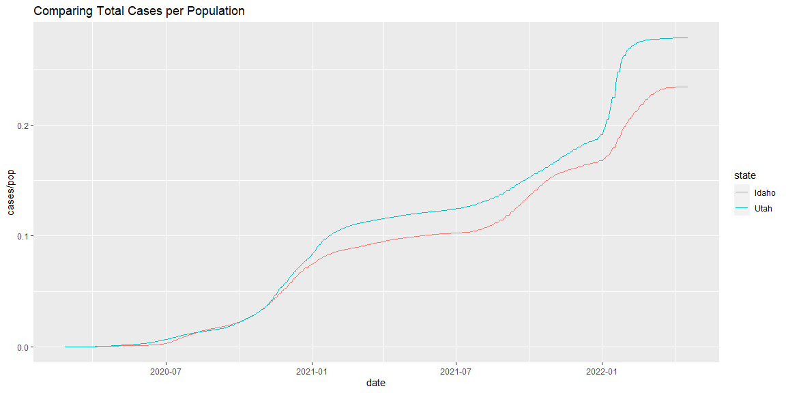<!-- -->

We can repeat the above by looking at daily new cases, rather than total cases. The first plot ignores population counts, while the second includes this information. 


```r
covid_state_data %>% 
  filter(state %in% c("Idaho","Utah")) %>% 
  ggplot(aes(x = date, y = daily_new_cases)) +
  geom_line() +
  facet_wrap(~state) +
  labs(title = "Comparing Total New Cases in Two States")
```

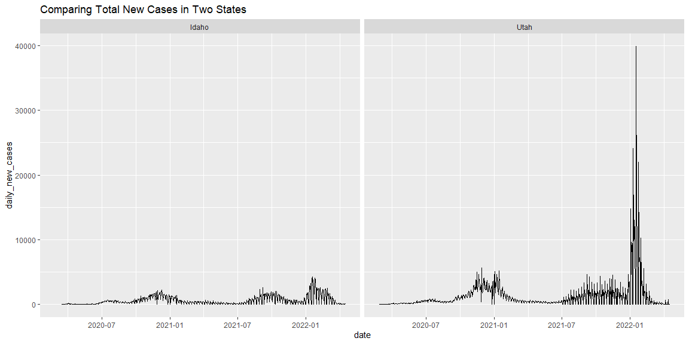<!-- -->


```r
covid_state_data %>% 
  filter(state %in% c("Idaho","Utah")) %>%
  mutate(daily_new_cases_per_pop = daily_new_cases/pop) %>% 
  ggplot(aes(x = date, y = daily_new_cases_per_pop)) +
  geom_line() +
  facet_wrap(~state) +
  labs(title = "Comparing New Cases Per Population")
```

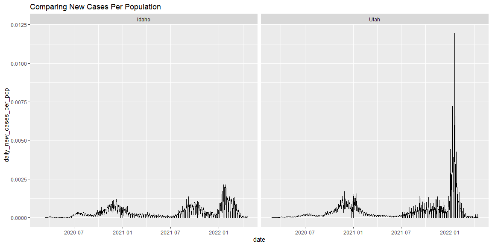<!-- -->

Let's now compare California and Florida. Note that California's population is almost twice Florida's. The first chart below ignores this fact. 


```r
covid_state_data %>% 
  filter(state %in% c("California","Florida")) %>% 
  ggplot(aes(x = date, y = cases)) +
  geom_line() +
  facet_wrap(~state) +
  labs(title = "Total Cases in Two States over time")
```

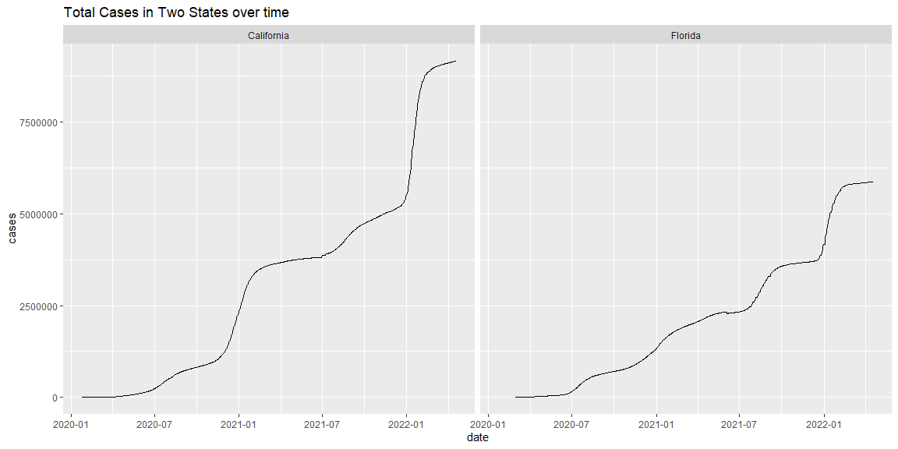<!-- -->


```r
covid_state_data %>% 
  filter(state %in% c("California","Florida")) %>% 
  ggplot(aes(x = date, y = cases/pop)) +
  geom_line() +
  facet_wrap(~state) +
  labs(title = "Total Cases Per Population in Two States over time")
```

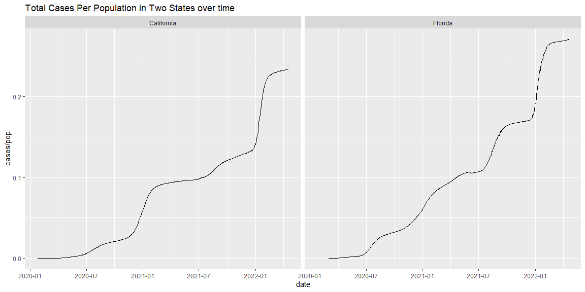<!-- -->

Looking at daily case counts can help easily examine when and where outbreaks occurred. Here are three options (that all account for population differences), with New York added to the last option. 


```r
covid_state_data %>% 
  filter(state %in% c("California","Florida", "Washington")) %>% 
  mutate(daily_new_cases_per_mil = daily_new_cases/pop*10^6) %>% 
  ggplot(aes(x = date, y = daily_new_cases_per_mil)) +
  geom_line() +
  facet_wrap(~state, nrow = 2) +
  labs(title = "Comparing New Cases Per Million")
```

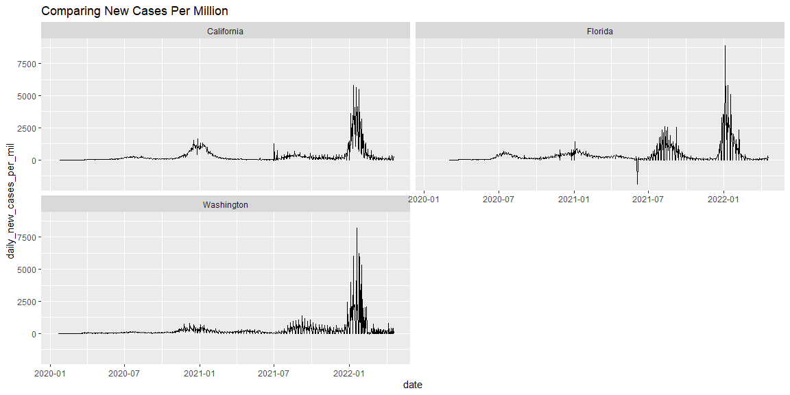<!-- -->


```r
covid_state_data %>% 
  filter(state %in% c("California","Florida")) %>% 
  mutate(daily_new_cases_per_thousand = daily_new_cases/pop*10^3) %>% 
  ggplot(aes(x = date, y = daily_new_cases_per_thousand)) +
  geom_line() +
  facet_wrap(~state) +
  labs(title = "Comparing New Cases Per Thousand")
```

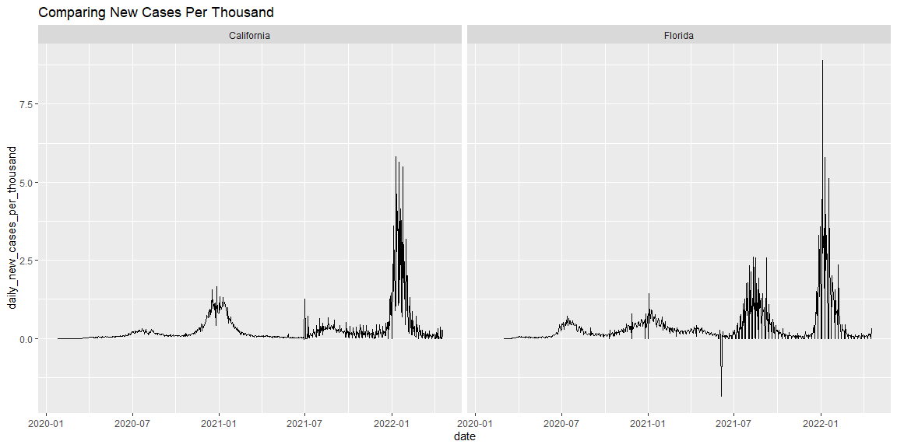<!-- -->


```r
covid_state_data %>% 
  #filter(state %in% c("Rhode Island")) %>% 
  mutate(daily_new_cases_per_thousand = daily_new_cases/pop*10^3) %>% 
  ggplot(aes(x = date, y = daily_new_cases_per_thousand, color = state)) +
  geom_line(alpha = 0.5) +
  labs(title = "Comparing New Cases Per Thousand")
```

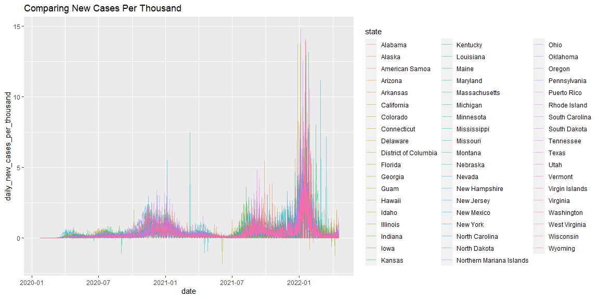<!-- -->

```r
#"California","Florida","New York",### Alaska, Alabama "Kansas", "Louisiana", Missouri, New Hampshire, South Carolina, Oklahoma, Rhode Island!!! 
```


In the `.Rmd` file, try changing the states to compare other states. Use the play button on the corresponding code chunk to get a preview of what the new code will look like, before you Knit the document again. 

Can you find the states that experienced the most explosive outbreak of COVID?

## Conclusions
These graphs use data that's updated every day, so I'll let you make any interesting observations about the most recent trends.  It is interesting to note that in June of 2021, there appears to be a day where -40000 cases were reported in Florida, so this is most likely an over count that was corrected on that day.

## Additional Examples Using Built in Data Sets
Here are some graphics related to the mtcars data set we already explored, as well as a new mpg data set that people commonly use when sharing examples online. The point for sharing them here is to help you see that when working with ggplot, there is a very common flow for producing graphics.  We'll explore this in depth over the next few weeks. 


```r
mtcars %>% head()
```

```
##                    mpg cyl disp  hp drat    wt  qsec vs am gear carb
## Mazda RX4         21.0   6  160 110 3.90 2.620 16.46  0  1    4    4
## Mazda RX4 Wag     21.0   6  160 110 3.90 2.875 17.02  0  1    4    4
## Datsun 710        22.8   4  108  93 3.85 2.320 18.61  1  1    4    1
## Hornet 4 Drive    21.4   6  258 110 3.08 3.215 19.44  1  0    3    1
## Hornet Sportabout 18.7   8  360 175 3.15 3.440 17.02  0  0    3    2
## Valiant           18.1   6  225 105 2.76 3.460 20.22  1  0    3    1
```

```r
mtcars %>% 
  ggplot(aes(x = wt, y = mpg))+
  geom_point()
```

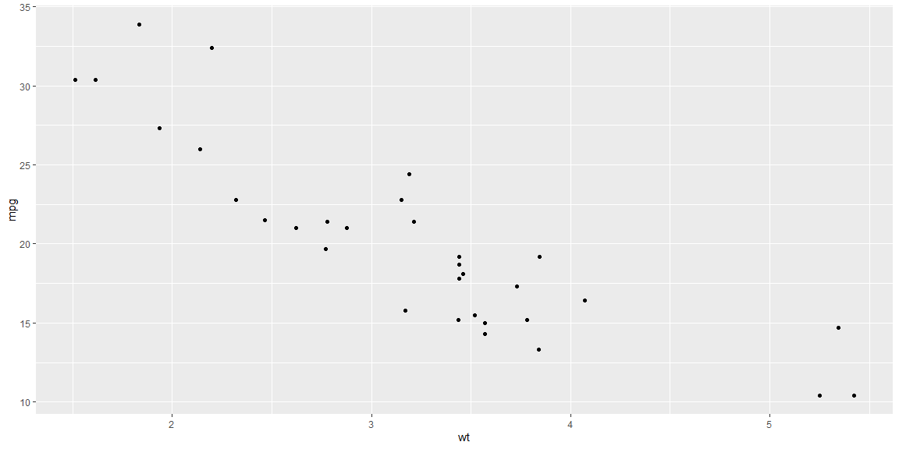<!-- -->

```r
mtcars %>% 
  ggplot(aes(x = wt, y = mpg))+
  geom_point() +
  facet_wrap(~am)
```

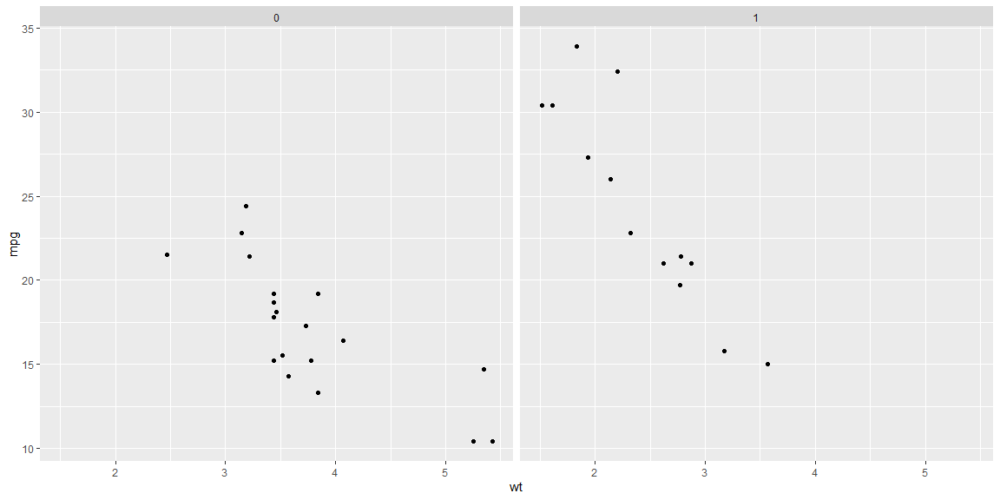<!-- -->

```r
mtcars %>% 
  ggplot(aes(x = wt, y = mpg, color = am))+
  geom_point()
```

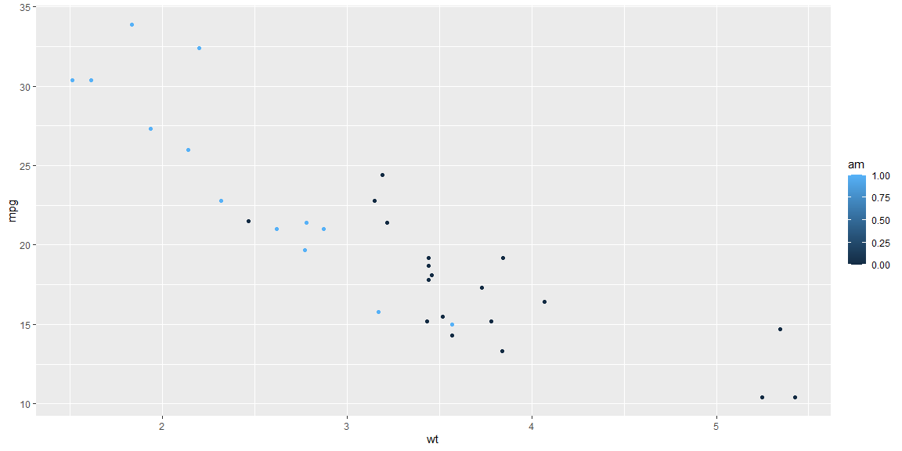<!-- -->

```r
mtcars %>% 
  mutate(am = factor(am)) %>% 
  ggplot(aes(x = wt, y = mpg, color = am))+
  geom_point()
```

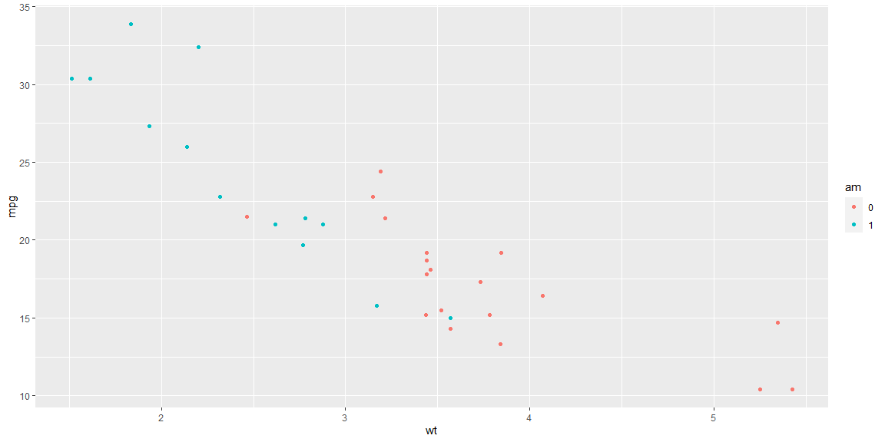<!-- -->

```r
mtcars %>% 
  mutate(am = factor(am)) %>% 
  ggplot(aes(x = wt, y = mpg, color = am))+
  geom_point() +
  geom_smooth()
```

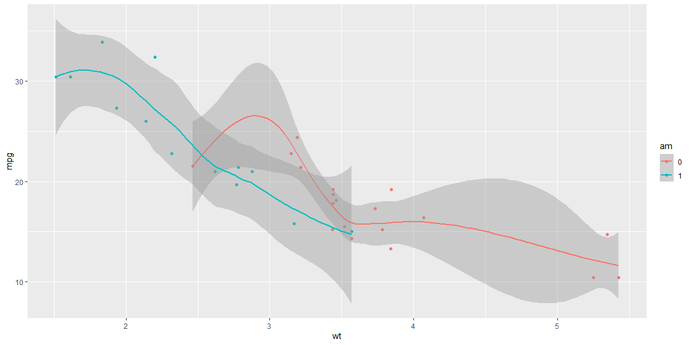<!-- -->


```r
mpg %>% glimpse()
```

```
## Rows: 234
## Columns: 11
## $ manufacturer <chr> "audi", "audi", "audi", "audi", "audi", "audi", "audi", "~
## $ model        <chr> "a4", "a4", "a4", "a4", "a4", "a4", "a4", "a4 quattro", "~
## $ displ        <dbl> 1.8, 1.8, 2.0, 2.0, 2.8, 2.8, 3.1, 1.8, 1.8, 2.0, 2.0, 2.~
## $ year         <int> 1999, 1999, 2008, 2008, 1999, 1999, 2008, 1999, 1999, 200~
## $ cyl          <int> 4, 4, 4, 4, 6, 6, 6, 4, 4, 4, 4, 6, 6, 6, 6, 6, 6, 8, 8, ~
## $ trans        <chr> "auto(l5)", "manual(m5)", "manual(m6)", "auto(av)", "auto~
## $ drv          <chr> "f", "f", "f", "f", "f", "f", "f", "4", "4", "4", "4", "4~
## $ cty          <int> 18, 21, 20, 21, 16, 18, 18, 18, 16, 20, 19, 15, 17, 17, 1~
## $ hwy          <int> 29, 29, 31, 30, 26, 26, 27, 26, 25, 28, 27, 25, 25, 25, 2~
## $ fl           <chr> "p", "p", "p", "p", "p", "p", "p", "p", "p", "p", "p", "p~
## $ class        <chr> "compact", "compact", "compact", "compact", "compact", "c~
```

```r
mpg %>% 
  ggplot(aes(x = class, y = cty))+
  geom_boxplot()
```

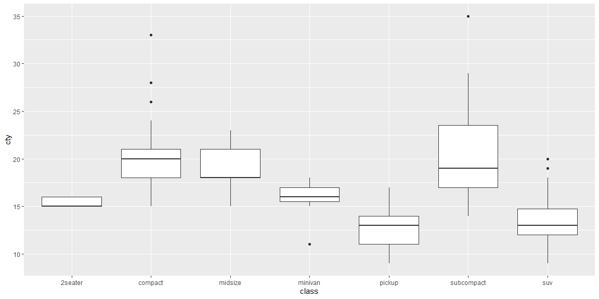<!-- -->

Here's one more dataset, with an accompanying histogram and scatterplot. 

```r
beaver1 %>% glimpse()
```

```
## Rows: 114
## Columns: 4
## $ day   <dbl> 346, 346, 346, 346, 346, 346, 346, 346, 346, 346, 346, 346, 346,~
## $ time  <dbl> 840, 850, 900, 910, 920, 930, 940, 950, 1000, 1010, 1020, 1030, ~
## $ temp  <dbl> 36.33, 36.34, 36.35, 36.42, 36.55, 36.69, 36.71, 36.75, 36.81, 3~
## $ activ <dbl> 0, 0, 0, 0, 0, 0, 0, 0, 0, 0, 0, 0, 0, 0, 0, 0, 0, 0, 0, 0, 0, 0~
```

```r
beaver1 %>% 
  ggplot(aes(x = temp)) +
  geom_histogram()
```

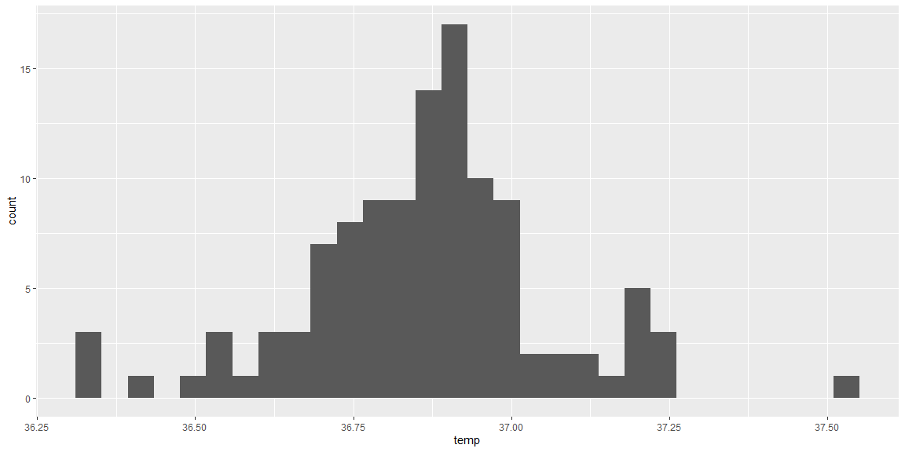<!-- -->

```r
beaver1 %>% 
  ggplot(aes(x = time, y = temp)) +
  geom_point()
```

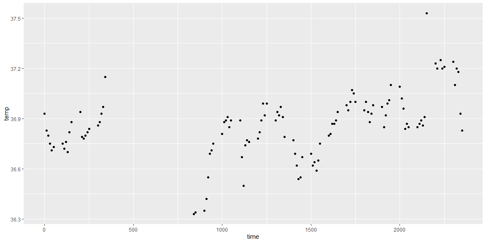<!-- -->


## Additional Packages
There are tons of packages freely available for use. 
At the beginning of our document you'll notice we loaded the `leaflet` package (see https://rstudio.github.io/leaflet/ for more info).  
We can use this to construct interactive maps. 


```r
m <- leaflet() %>%  #BYU-Idaho's location from Google is 43.8144° N, 111.7833° W
  addTiles() %>%  # Add default OpenStreetMap map tiles
  addMarkers(lng=-111.7833, lat=43.8144, popup="BYU - Idaho")
m  # Print the map
```

```{=html}
<div id="htmlwidget-e1c6d73ffb69e42471a1" style="width:1152px;height:576px;" class="leaflet html-widget"></div>
<script type="application/json" data-for="htmlwidget-e1c6d73ffb69e42471a1">{"x":{"options":{"crs":{"crsClass":"L.CRS.EPSG3857","code":null,"proj4def":null,"projectedBounds":null,"options":{}}},"calls":[{"method":"addTiles","args":["https://{s}.tile.openstreetmap.org/{z}/{x}/{y}.png",null,null,{"minZoom":0,"maxZoom":18,"tileSize":256,"subdomains":"abc","errorTileUrl":"","tms":false,"noWrap":false,"zoomOffset":0,"zoomReverse":false,"opacity":1,"zIndex":1,"detectRetina":false,"attribution":"&copy; <a href=\"https://openstreetmap.org\">OpenStreetMap<\/a> contributors, <a href=\"https://creativecommons.org/licenses/by-sa/2.0/\">CC-BY-SA<\/a>"}]},{"method":"addMarkers","args":[43.8144,-111.7833,null,null,null,{"interactive":true,"draggable":false,"keyboard":true,"title":"","alt":"","zIndexOffset":0,"opacity":1,"riseOnHover":false,"riseOffset":250},"BYU - Idaho",null,null,null,null,{"interactive":false,"permanent":false,"direction":"auto","opacity":1,"offset":[0,0],"textsize":"10px","textOnly":false,"className":"","sticky":true},null]}],"limits":{"lat":[43.8144,43.8144],"lng":[-111.7833,-111.7833]}},"evals":[],"jsHooks":[]}</script>
```


```r
m <- leaflet()
m <- addTiles(m)
m <- addMarkers(m, lng=-111.7833, lat=43.8144, popup="The birthplace of R")
m
```

```{=html}
<div id="htmlwidget-074bb4ed03ed96f8130e" style="width:1152px;height:576px;" class="leaflet html-widget"></div>
<script type="application/json" data-for="htmlwidget-074bb4ed03ed96f8130e">{"x":{"options":{"crs":{"crsClass":"L.CRS.EPSG3857","code":null,"proj4def":null,"projectedBounds":null,"options":{}}},"calls":[{"method":"addTiles","args":["https://{s}.tile.openstreetmap.org/{z}/{x}/{y}.png",null,null,{"minZoom":0,"maxZoom":18,"tileSize":256,"subdomains":"abc","errorTileUrl":"","tms":false,"noWrap":false,"zoomOffset":0,"zoomReverse":false,"opacity":1,"zIndex":1,"detectRetina":false,"attribution":"&copy; <a href=\"https://openstreetmap.org\">OpenStreetMap<\/a> contributors, <a href=\"https://creativecommons.org/licenses/by-sa/2.0/\">CC-BY-SA<\/a>"}]},{"method":"addMarkers","args":[43.8144,-111.7833,null,null,null,{"interactive":true,"draggable":false,"keyboard":true,"title":"","alt":"","zIndexOffset":0,"opacity":1,"riseOnHover":false,"riseOffset":250},"The birthplace of R",null,null,null,null,{"interactive":false,"permanent":false,"direction":"auto","opacity":1,"offset":[0,0],"textsize":"10px","textOnly":false,"className":"","sticky":true},null]}],"limits":{"lat":[43.8144,43.8144],"lng":[-111.7833,-111.7833]}},"evals":[],"jsHooks":[]}</script>
```


Try modifying the code above to get the map to center on some place of importance to you. 
If you have extra time, explore the leaflet website linked to above, and add some extra features to your map. 
